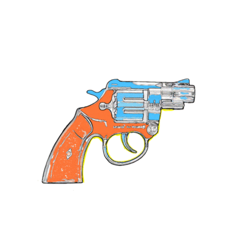

## Russian Roulette Game
<div align="center">
  
</div>

<br />

PLEASE, install playsound-1.1.2 module to be able to play the sound effect of shooting:
```
pip3 install playsound==1.2.2
```
--------------------------------------------------------------------------------------------------------------


### Rules
Russian Roulette game made in python. The rules are simple: Each player has to press enter to pull the trigger
and the player that hits the chambers that contains the bullet, losses!

After the game is over the user has the option to restart the game.

Usage:


- Run it
```bash
python russian_roulette.py
```

- To pull the trigger press the enter key
- When the game is empty press y to restart the game or no/enter to exit the game.
